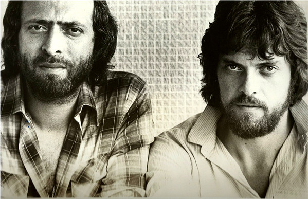

# The Alan Parsons Project

## Artist Profile

British Rock studio project initially formed to record a concept album about Edgar Allan Poe. They became best known for the power ballad "Eye in the Sky" and the instrumental "Sirius".

Official band members
● Alan Parsons – production, engineering, programming, composition, keyboards, guitar
● Eric Woolfson – composition, lyrics, piano, keyboards, vocals, executive production

Notable contributors
● Andrew Powell – composition, keyboards, orchestral arrangements (1975-1990)
● Philharmonia Orchestra
● The English Chorale – choir (1976, 1977, 1982, 1987)
● Ian Bairnson – guitar (1975–1990)
● David Pack – guitar (1976)
● David Paton – bass, vocals (1975–1985)
● Duncan Mackay – keyboards (1977–1979)
● Richard Cottle – keyboards, saxophone (1984–1990)
● Laurence Cottle – bass (1987-1990)
● Stuart Tosh – drums, percussion (1975–1976)
● Stuart Elliott – drums, percussion (1977–1990)
● John Leach – cimbalom, kantele (1976–1978)
● Colin Blunstone – vocals (1978–1984)
● Chris Rainbow – vocals (1979–1990)
● Lenny Zakatek – vocals (1977–1987)
● John Miles – vocals (1976, 1978, 1985, 1987)
● Jack Harris – vocals (1976–1978)
● Dave Townsend – vocals (1977, 1979)
● Elmer Gantry a.k.a. Dave Terry (4) – vocals (1980, 1982)
● Graham Dye – vocals (1985, 1990)

Non-recurring vocalists include: Arthur Brown (1975), Allan Clarke (1977), Peter Straker (1977), Jaki Whitren (1977), Dean Ford (1978), Clare Torry (1979), Lesley Duncan (1979), Gary Brooker (1985), Geoff Barradale (1987), Eric Stewart (1990)

## Artist Links

- [https://alanparsons.com/](https://alanparsons.com/)
- [http://amiright.com/artists/alanparsonsproject.shtml](http://amiright.com/artists/alanparsonsproject.shtml)
- [https://www.facebook.com/TheAlanParsonsProject](https://www.facebook.com/TheAlanParsonsProject)
- [https://the-alan-parsons-project.com/](https://the-alan-parsons-project.com/)
- [https://genius.com/artists/The-alan-parsons-project](https://genius.com/artists/The-alan-parsons-project)
- [https://www.last.fm/music/The+Alan+Parsons+Project](https://www.last.fm/music/The+Alan+Parsons+Project)
- [http://www.progarchives.com/artist.asp?id=286](http://www.progarchives.com/artist.asp?id=286)
- [https://en.wikipedia.org/wiki/The_Alan_Parsons_Project](https://en.wikipedia.org/wiki/The_Alan_Parsons_Project)

## See also

- [Eye In The Sky](Eye_In_The_Sky.md)
- [The Turn Of A Friendly Card](The_Turn_Of_A_Friendly_Card.md)
