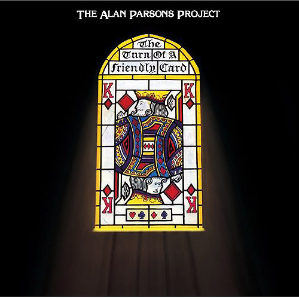

# The Turn Of A Friendly Card

By The Alan Parsons Project

## Album Data

[Discogs URL](https://www.discogs.com/release/2989200-The-Alan-Parsons-Project-The-Turn-Of-A-Friendly-Card)

- Label: Speakers Corner Records
Arista
- Formats: Vinyl, LP, Album, Remastered
- Genres: Electronic, Rock, Pop, Synth-pop, Symphonic Rock
- Rating: 4.67
- Released: 2005-01-07
- Year: 1980
- Release ID: 2989200
- Media condition: 
- Sleeve condition: 
- Speed: 
- Weight: 
- Notes: 

## Album Tracks

| **Position** | **Title** | **Duration** |
|--------------|-----------|--------------|
| A1 | **May Be A Price To Pay** | 4:52 |
| A2 | **Games People Play** | 4:17 |
| A3 | **Time** | 5:05 |
| A4 | **I Don't Wanna Go Home** | 4:54 |
| B1 | **The Gold Bug** | 4:28 |
|  | **The Turn Of A Friendly Card** | 16:19 |

## Artist Roles

| **Name** | **Role** |
|----------|----------|
| **Willem Makkee** | Mastered By |
| **Alan Parsons** | Producer, Engineer |
| **Alan Parsons** | Written-By |
| **Eric Woolfson** | Written-By |

