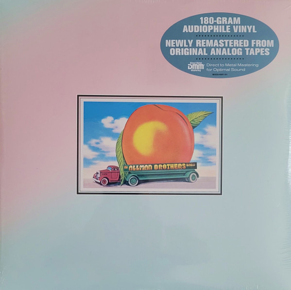

# Eat A Peach

By The Allman Brothers Band

## Album Data

[Discogs URL](https://www.discogs.com/release/8804744-The-Allman-Brothers-Band-Eat-A-Peach)

- Label: Mercury
- Formats: Vinyl, LP, Album, Reissue, Remastered
- Genres: Rock, Blues, Blues Rock, Southern Rock
- Rating: 4.77
- Released: 2016-07-22
- Year: 1972
- Release ID: 8804744
- Media condition: 
- Sleeve condition: 
- Speed: 
- Weight: 
- Notes: 

## Album Tracks

| **Position** | **Title** | **Duration** |
|--------------|-----------|--------------|
| A1 | **Ain't Wastin' Time No More** | 3:41 |
| A2 | **Les Brers In A Minor** | 9:07 |
| A3 | **Melissa** | 3:56 |
| B | **Mountain Jam** | 19:17 |
| C1 | **One Way Out** | 4:59 |
| C2 | **Trouble No More** | 3:44 |
| C3 | **Stand Back** | 3:25 |
| C4 | **Blue Sky** | 5:11 |
| C5 | **Little Martha** | 2:09 |
| D | **Mountain Jam Cont'd.** | 15:06 |

## Artist Roles

| **Name** | **Role** |
|----------|----------|
| **The Allman Brothers Band** | Arranged By [All Arrangements] |
| **James Flournoy Holmes** | Design [Album], Illustration |
| **W. David Powell** | Design [Album], Illustration |
| **Aaron Baron** | Engineer |
| **Howard Albert** | Engineer |
| **Larry Dahlstrom** | Engineer |
| **Ron Albert** | Engineer |
| **Wonder Graphics** | Graphics |
| **Willie Perkins (2)** | Management [Road Manager] |
| **Joe Dan Petty** | Other [Equipment & Stage] |
| **Kim Payne** | Other [Equipment & Stage] |
| **Red Dog (5)** | Other [Equipment & Stage] |
| **Tom Dowd** | Producer |
| **Kevin Reeves** | Remastered By |

