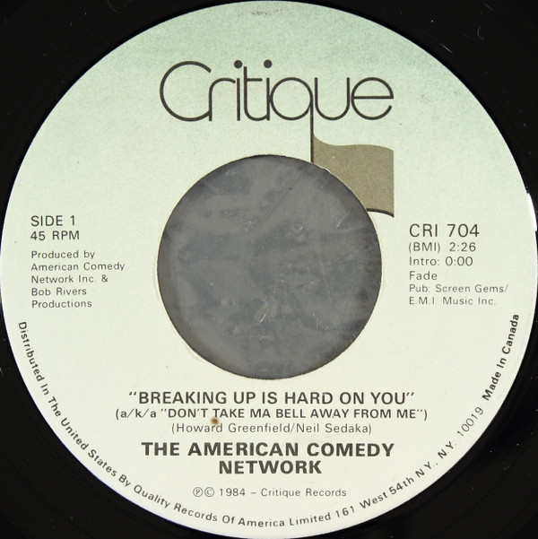

# Breaking Up Is Hard On You (a/k/a Don't Take Ma Bell Away From Me)

By The American Comedy Network

## Album Data

[Discogs URL](https://www.discogs.com/release/3132149-The-American-Comedy-Network-Breaking-Up-Is-Hard-On-You-aka-Dont-Take-Ma-Bell-Away-From-Me)

- Label: Critique
- Formats: Vinyl, 7", 45 RPM
- Genres: Rock, Non-Music, Pop, Comedy, Parody
- Rating: 4
- Released: 1984
- Year: 1984
- Release ID: 3132149
- Media condition: 
- Sleeve condition: 
- Speed: 
- Weight: 
- Notes: 

## Album Tracks

| **Position** | **Title** | **Duration** |
|--------------|-----------|--------------|
| A | **Breaking Up Is Hard On You (a/k/a Don't Take Ma Bell Away From Me)** | 2:26 |
| B1 | **Krapco's Mr. Cardboard Tube** | 1:02 |
| B2 | **Krapco Home Psychiatrist** | 1:02 |
| B3 | **Krapco Gene Splicer** | 1:06 |

## Artist Roles

| **Name** | **Role** |
|----------|----------|
| **Todd Deasey** | Lacquer Cut By |
| **Mahlon Merrick** | Music By [The Gillette Look Sharp March] |
| **Bob Rivers (2)** | Producer |
| **The American Comedy Network** | Producer |
| **The American Comedy Network** | Written-By |

