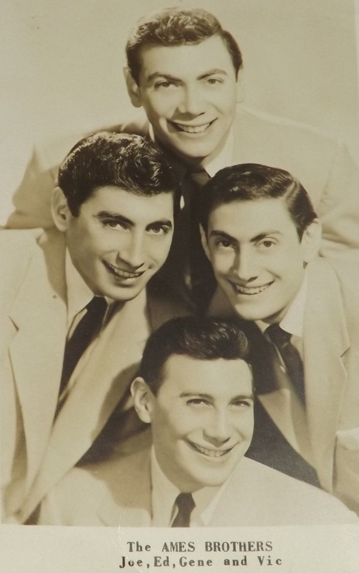

# The Ames Brothers

## Artist Profile

The Ames Brothers were a singing quartet from Malden, Massachusetts, U.S.A, who were particularly famous in the 1950s for their traditional pop music hits.

The Ames Brothers got their beginning in Malden, where all four were born. The act consisted of Joe (3 May 1921 – 22 December 2007), Gene (born 13 February 1923 – 4 April 1997), Vic (20 May 1925 – 23 January 1978) and Ed (born 9 July 1927).

## Artist Links

- [http://en.wikipedia.org/wiki/Ames_Brothers](http://en.wikipedia.org/wiki/Ames_Brothers)
- [http://www.vocalgroup.org/inductees/ames_brothers.htm](http://www.vocalgroup.org/inductees/ames_brothers.htm)
- [https://www.imdb.com/name/nm1683714/](https://www.imdb.com/name/nm1683714/)

## See also

- [The Naughty Lady Of Shady Lane](The_Naughty_Lady_Of_Shady_Lane.md)
