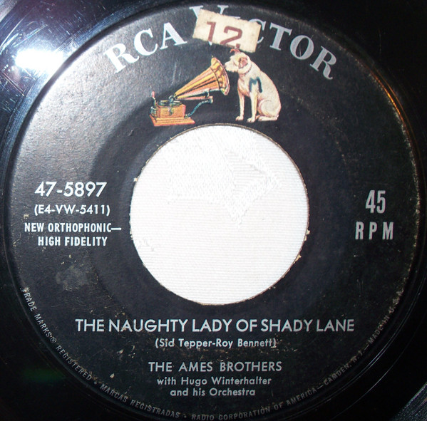

# The Naughty Lady Of Shady Lane

By The Ames Brothers

## Album Data

[Discogs URL](https://www.discogs.com/release/7337497-The-Ames-Brothers-With-Hugo-Winterhalter-And-His-Orchestra-The-Naughty-Lady-Of-Shady-Lane)

- Label: RCA Victor
- Formats: Vinyl, 7", 45 RPM
- Genres: Pop, Vocal
- Rating: 4.33
- Released: 1954
- Year: 1954
- Release ID: 7337497
- Media condition: 
- Sleeve condition: 
- Speed: 
- Weight: 
- Notes: 

## Album Tracks

| **Position** | **Title** | **Duration** |
|--------------|-----------|--------------|
| A | **The Naughty Lady Of Shady Lane** |  |
| B | **Addio** |  |

