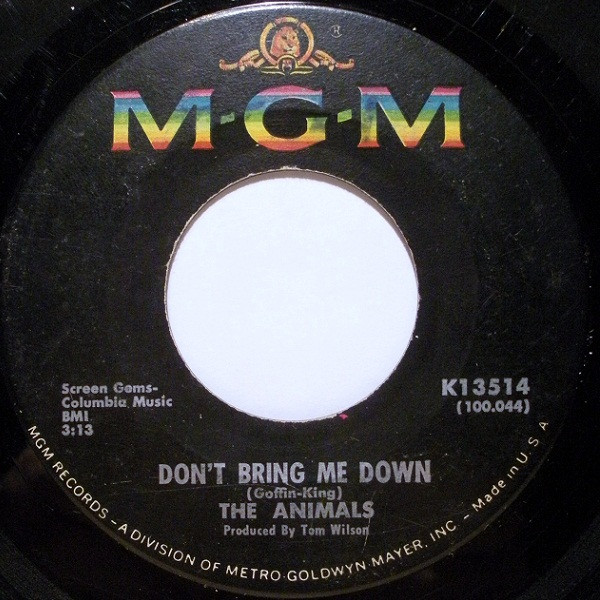

# Don't Bring Me Down

By The Animals

## Album Data

[Discogs URL](https://www.discogs.com/release/1199683-The-Animals-Dont-Bring-Me-Down)

- Label: MGM Records
- Formats: Vinyl, 7", 45 RPM, Single
- Genres: Rock, Rock & Roll
- Rating: 3.89
- Released: 1966-05-21
- Year: 1966
- Release ID: 1199683
- Media condition: 
- Sleeve condition: 
- Speed: 
- Weight: 
- Notes: 

## Album Tracks

| **Position** | **Title** | **Duration** |
|--------------|-----------|--------------|
| A | **Don't Bring Me Down** | 3:13 |
| B | **Cheating** | 2:23 |

## Artist Roles

| **Name** | **Role** |
|----------|----------|
| **Tom Wilson (2)** | Producer |

