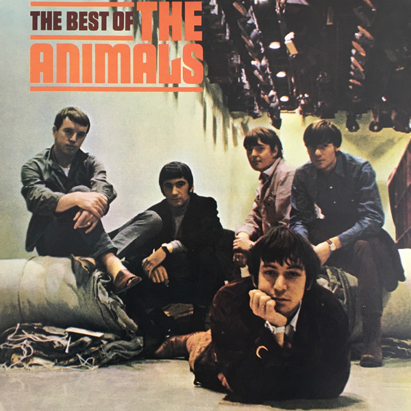

# The Best Of The Animals

By The Animals

## Album Data

[Discogs URL](https://www.discogs.com/release/5980178-The-Animals-The-Best-Of-The-Animals)

- Label: ABKCO
- Formats: Vinyl, LP, Compilation, Reissue, Remastered
- Genres: Rock, Blues, Blues Rock
- Rating: 4.3
- Released: 2014-08-12
- Year: 1966
- Release ID: 5980178
- Media condition: 
- Sleeve condition: 
- Speed: 
- Weight: 
- Notes: 

## Album Tracks

| **Position** | **Title** | **Duration** |
|--------------|-----------|--------------|
| A1 | **House Of The Rising Sun** | 4:32 |
| A2 | **I'm Crying** | 2:48 |
| A3 | **Baby Let Me Take You Home** | 2:21 |
| A4 | **Around And Around** | 2:46 |
| A5 | **Talkin' Bout You** | 1:53 |
| A6 | **Don't Let Me Be Misunderstood** | 2:29 |
| A7 | **Boom Boom** | 3:19 |
| A8 | **Dimples** | 3:18 |
| B1 | **We Gotta Get Out Of This Place** | 3:13 |
| B2 | **I'm In Love Again** | 3:02 |
| B3 | **Bury My Body** | 2:52 |
| B4 | **Gonna Send You Back To Walker** | 2:30 |
| B5 | **Story Of Bo Diddley** | 5:46 |
| B6 | **It's My Life** | 3:08 |
| B7 | **Bring It On Home To Me** | 2:42 |

## Artist Roles

| **Name** | **Role** |
|----------|----------|
| **Carl Rowatti** | Lacquer Cut By |
| **Adam Ayan** | Mastered By |
| **Mickie Most** | Producer |

