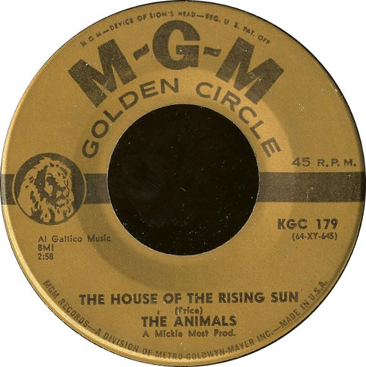

# The House Of The Rising Sun / I'm Crying

By The Animals

## Album Data

[Discogs URL](https://www.discogs.com/release/2224275-The-Animals-The-House-Of-The-Rising-Sun-Im-Crying)

- Label: MGM Records
- Formats: Vinyl, 7", 45 RPM, Reissue
- Genres: Rock, Funk / Soul, Rock & Roll, Blues Rock
- Rating: 4.09
- Released: null
- Year: 1968
- Release ID: 2224275
- Media condition: 
- Sleeve condition: 
- Speed: 
- Weight: 
- Notes: 

## Album Tracks

| **Position** | **Title** | **Duration** |
|--------------|-----------|--------------|
| A | **The House Of The Rising Sun** | 2:58 |
| B | **I'm Crying** | 2:30 |

## Artist Roles

| **Name** | **Role** |
|----------|----------|
| **Mickie Most** | Producer [Prod.] |

