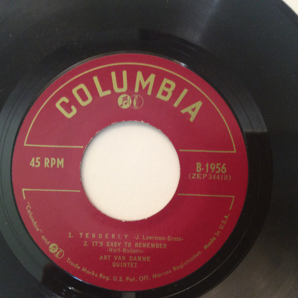

# My Kinda Love / Tenderly

By The Art Van Damme Quintet

## Album Data

[Discogs URL](https://www.discogs.com/release/9735652-The-Art-Van-Damme-Quintet-My-Kinda-Love-Tenderly)

- Label: Columbia
- Formats: Vinyl, 7", 45 RPM
- Genres: Jazz, Easy Listening, Swing
- Rating: 0
- Released: null
- Year: 0
- Release ID: 9735652
- Media condition: 
- Sleeve condition: 
- Speed: 
- Weight: 
- Notes: 

## Album Tracks

| **Position** | **Title** | **Duration** |
|--------------|-----------|--------------|
| A1 | **My Kinda Love** |  |
| A2 | **I Hear Music** |  |
| B1 | **Tenderly** |  |
| B2 | **It's Easy To Remember** |  |

