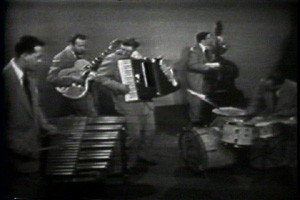

# The Art Van Damme Quintet

## Artist Profile

Art Van Damme and his quintet were NBC-Chicago staff musicians from roughly 1945 to 1960.They performed on a wide variety of shows, both radio and television.

## Artist Links

- [http://www.richsamuels.com/nbcmm/garroway/art_van_damme.html](http://www.richsamuels.com/nbcmm/garroway/art_van_damme.html)

## See also

- [My Kinda Love / Tenderly](My_Kinda_Love_-_Tenderly.md)
