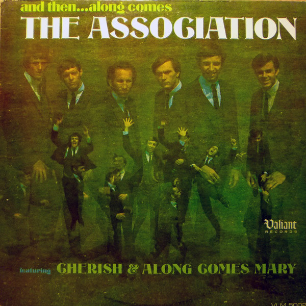

# And Then...Along Comes The Association

By The Association

## Album Data

[Discogs URL](https://www.discogs.com/release/2347294-The-Association-And-ThenAlong-Comes-The-Association)

- Label: Valiant Records (2)
- Formats: Vinyl, LP, Album, Mono
- Genres: Rock, Pop, Pop Rock, Folk Rock
- Rating: 3.73
- Released: 1966-07-00
- Year: 1966
- Release ID: 2347294
- Media condition: 
- Sleeve condition: 
- Speed: 
- Weight: 
- Notes: 

## Album Tracks

| **Position** | **Title** | **Duration** |
|--------------|-----------|--------------|
| A1 | **Enter The Young** | 2:42 |
| A2 | **Your Own Love** | 2:19 |
| A3 | **Don't Blame It On Me** | 2:26 |
| A4 | **Blistered** | 1:45 |
| A5 | **I'll Be Your Man** | 2:45 |
| A6 | **Along Comes Mary** | 2:30 |
| B1 | **Cherish** | 3:25 |
| B2 | **Standing Still** | 2:43 |
| B3 | **Message Of Our Love** | 3:56 |
| B4 | **Round Again** | 1:48 |
| B5 | **Remember** | 2:35 |
| B6 | **Changes** | 2:30 |

## Artist Roles

| **Name** | **Role** |
|----------|----------|
| **Peter Whorf Graphics** | Design [Album Designed By] |
| **Gary Paxton** | Engineer |
| **Peter Romano** | Engineer |
| **Phyllis Burgess** | Liner Notes |
| **Brian Cole (2)** | Performer |
| **Gary Alexander** | Performer |
| **Jim Yester** | Performer |
| **Russ Giguere** | Performer |
| **Ted Bluechel, Jr.** | Performer |
| **Terry Kirkman** | Performer |
| **Fred Poore** | Photography By [Cover] |
| **Curt Boettcher** | Producer |

