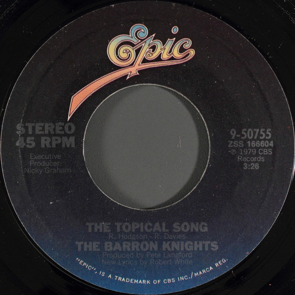

# The Topical Song / The Big V-Asectomy

By The Barron Knights

## Album Data

[Discogs URL](https://www.discogs.com/release/4252981-The-Barron-Knights-The-Topical-Song-The-Big-V-Asectomy)

- Label: Epic
- Formats: Vinyl, 7", 45 RPM, Single, Styrene, Stereo
- Genres: Rock, Pop, Folk, World, & Country, Parody, Novelty, Pop Rock, Country
- Rating: 3
- Released: 1979
- Year: 1979
- Release ID: 4252981
- Media condition: 
- Sleeve condition: 
- Speed: 
- Weight: 
- Notes: 

## Album Tracks

| **Position** | **Title** | **Duration** |
|--------------|-----------|--------------|
| A | **The Topical Song ** | 3:26 |
| B | **The Big V-Asectomy ** | 2:35 |

## Artist Roles

| **Name** | **Role** |
|----------|----------|
| **Peter Langford** | Producer |

