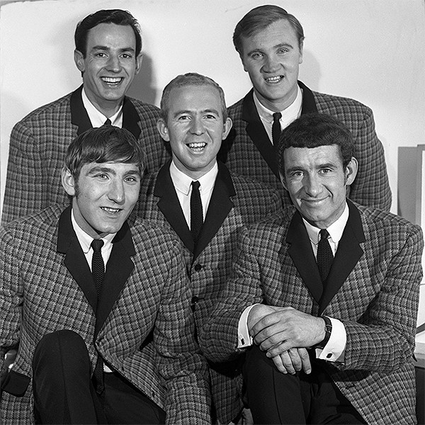

# The Barron Knights

## Artist Profile

British pop group best known for its parodies of popular songs. Founded in 1959 by guitarist Peter Langford and bass player Barron Anthony in Leighton Buzzard, Bedfordshire, England and was later joined by lead vocalist Duke D'Mond in 1961.

Original Line-up:
Duke D'Mond (Richard Edward Palmer) - Vocalist 
Barron Anthony (Anthony John Osmond) - Guitarist / Vocalist 
Butch Baker (Leslie John Baker) - Guitarist / Vocalist
Pete Langford - Bassist / Vocalist 
Dave Ballinger (David Alan Ballinger) - Drummer

As of 2007, only Peter Langford remains from the original line-up.

## Artist Links

- [http://www.barronknights.com/](http://www.barronknights.com/)
- [https://en.wikipedia.org/wiki/The_Barron_Knights](https://en.wikipedia.org/wiki/The_Barron_Knights)

## See also

- [The Topical Song / The Big V-Asectomy](The_Topical_Song_-_The_Big_V-Asectomy.md)
