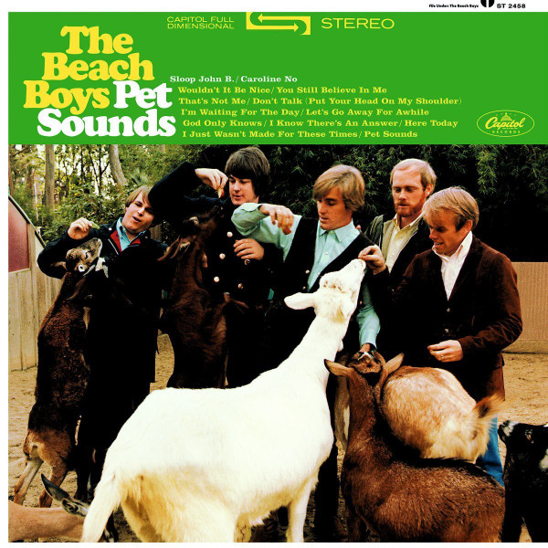

# Pet Sounds

By The Beach Boys

## Album Data

[Discogs URL](https://www.discogs.com/release/8627508-The-Beach-Boys-Pet-Sounds)

- Label: UMe
Capitol Records
- Formats: Vinyl, LP, Album, Reissue, Remastered, Stereo
- Genres: Rock, Pop, Psychedelic Rock, Pop Rock
- Rating: 4.63
- Released: 2016-06-10
- Year: 1966
- Release ID: 8627508
- Media condition: 
- Sleeve condition: 
- Speed: 
- Weight: 
- Notes: 

## Album Tracks

| **Position** | **Title** | **Duration** |
|--------------|-----------|--------------|
| A1 | **Wouldn't It Be Nice** | 2:22 |
| A2 | **You Still Believe In Me** | 2:33 |
| A3 | **That's Not Me** | 2:27 |
| A4 | **Don't Talk (Put Your Head On My Shoulder)** | 2:52 |
| A5 | **I'm Waiting For The Day** | 3:01 |
| A6 | **Let's Go Away For Awhile** | 2:18 |
| A7 | **Sloop John B** | 2:57 |
| B1 | **God Only Knows** | 2:46 |
| B2 | **I Know There's An Answer** | 3:10 |
| B3 | **Here Today** | 2:38 |
| B4 | **I Just Wasn't Made For These Times** | 3:21 |
| B5 | **Pet Sounds** | 2:20 |
| B6 | **Caroline, No** | 2:16 |

