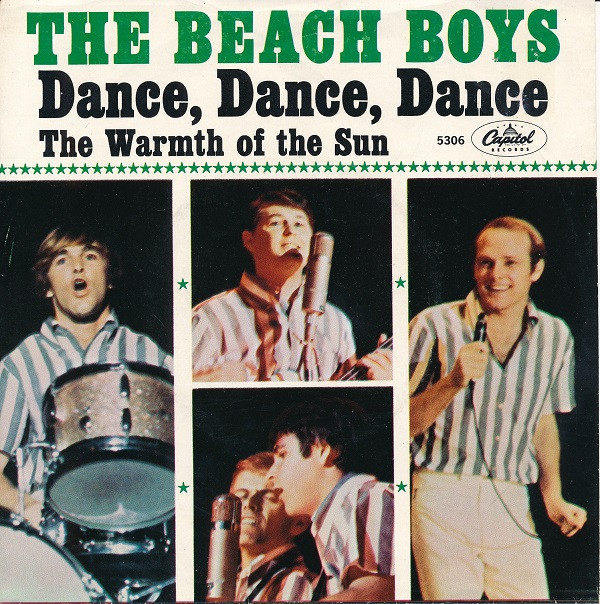

# Dance, Dance, Dance

By The Beach Boys

## Album Data

[Discogs URL](https://www.discogs.com/release/6289272-The-Beach-Boys-Dance-Dance-Dance)

- Label: Capitol Records
- Formats: Vinyl, 7", 45 RPM, Single
- Genres: Rock, Surf
- Rating: 4.5
- Released: 1964-10-26
- Year: 1964
- Release ID: 6289272
- Media condition: 
- Sleeve condition: 
- Speed: 
- Weight: 
- Notes: 

## Album Tracks

| **Position** | **Title** | **Duration** |
|--------------|-----------|--------------|
| A | **Dance, Dance, Dance** | 2:00 |
| B | **The Warmth Of The Sun** | 2:47 |

## Artist Roles

| **Name** | **Role** |
|----------|----------|
| **Brian Wilson** | Producer |

