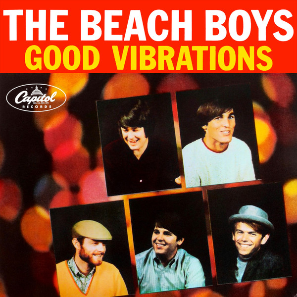

# Good Vibrations

By The Beach Boys

## Album Data

[Discogs URL](https://www.discogs.com/release/9156633-The-Beach-Boys-Good-Vibrations)

- Label: Capitol Records
- Formats: Vinyl, 12", Single, Limited Edition, Reissue, Repress
- Genres: Rock, Pop, Pop Rock, Surf
- Rating: 4.69
- Released: 2016-10-07
- Year: 1966
- Release ID: 9156633
- Media condition: 
- Sleeve condition: 
- Speed: 
- Weight: 
- Notes: 

## Album Tracks

| **Position** | **Title** | **Duration** |
|--------------|-----------|--------------|
| A1 | **Good Vibrations (Original 45 RPM Single Version)** |  |
| A2 | **Good Vibrations (Various Sessions)** |  |
| A3 | **Good Vibrations (Alternate Take)** |  |
| B1 | **Good Vibrations (Instrumental)** |  |
| B2 | **Good Vibrations (Live Concert Rehearsal 8/25/67)** |  |
| B3 | **Let's Go Away For Awhile (Original B-Side)** |  |

## Artist Roles

| **Name** | **Role** |
|----------|----------|
| **Ron McMaster** | Lacquer Cut By |
| **Brian Wilson** | Producer |
| **Brian Wilson** | Written-By |
| **Mike Love** | Written-By |

