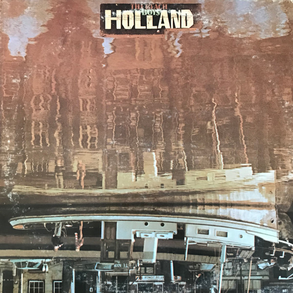

# Holland

By The Beach Boys

## Album Data

[Discogs URL](https://www.discogs.com/release/1568483-The-Beach-Boys-Holland)

- Label: Reprise Records
Brother Records (3)
- Formats: Vinyl
Vinyl, LP, Album, 7", 33 ⅓ RPM, EP
- Genres: Rock, Pop Rock, Spoken Word
- Rating: 3.93
- Released: 1973
- Year: 1973
- Release ID: 1568483
- Media condition: 
- Sleeve condition: 
- Speed: 
- Weight: 
- Notes: 

## Album Tracks

| **Position** | **Title** | **Duration** |
|--------------|-----------|--------------|
| A1 | **Sail On Sailor** | 3:15 |
| A2 | **Steamboat** | 4:29 |
|  | **California Saga** |  |
| B1 | **The Trader** | 5:01 |
| B2 | **Leaving This Town** | 5:36 |
| B3 | **Only With You** | 2:56 |
| B4 | **Funky Pretty** | 4:07 |
|  | **Mount Vernon And Fairway (A Fairy Tale)** |  |
| C1 | **Mt. Vernon And Fairway - Theme** | 1:30 |
| C2 | **I'm The Pied Piper** | 2:24 |
| C3 | **Better Get Back In Bed** | 1:42 |
| C4 | **Magic Transistor Radio** | 1:23 |
| D1 | **I'm The Pied Piper** | 3:00 |
| D2 | **Radio King Dom** | 2:37 |

## Artist Roles

| **Name** | **Role** |
|----------|----------|
| **Billy Hinsche** | Backing Vocals |
| **Bruce Johnston** | Backing Vocals |
| **Diane Rovell** | Backing Vocals |
| **Gerry Beckley** | Backing Vocals |
| **Marilyn Rovell Wilson** | Backing Vocals |
| **Tony Martin, Jr** | Backing Vocals |
| **Ricky Fataar** | Drums |
| **Brian Wilson** | Drums, Synthesizer, Piano |
| **Rob Fraboni** | Engineer |
| **Stephen Moffitt** | Engineer |
| **Charles Lloyd** | Flute |
| **Tony Martin, Jr** | Guitar |
| **Alan Jardine** | Guitar, Banjo |
| **Blondie Chaplin** | Guitar, Bass |
| **Jack Rieley** | Other [Additional Material By] |
| **Ricky Fataar** | Percussion |
| **Russ Mackie** | Photography By, Artwork |
| **Dennis Wilson (2)** | Piano |
| **Carl Wilson** | Piano, Electric Piano, Guitar |
| **Carl Wilson** | Producer |
| **The Beach Boys** | Producer |
| **Ricky Fataar** | Slide Guitar |
| **Rogier Van Otterloo** | Strings |
| **Ricky Fataar** | Synthesizer |
| **Carl Wilson** | Synthesizer [bass] |
| **Daryl Dragon** | Synthesizer [bass] |
| **Kevin Michaels** | Tambourine |
| **Frank Mayes** | Tenor Saxophone |
| **Alan Jardine** | Vocals |
| **Blondie Chaplin** | Vocals |
| **Brian Wilson** | Vocals |
| **Carl Wilson** | Vocals |
| **Dennis Wilson (2)** | Vocals |
| **Mike Love** | Vocals |
| **Ricky Fataar** | Vocals |

