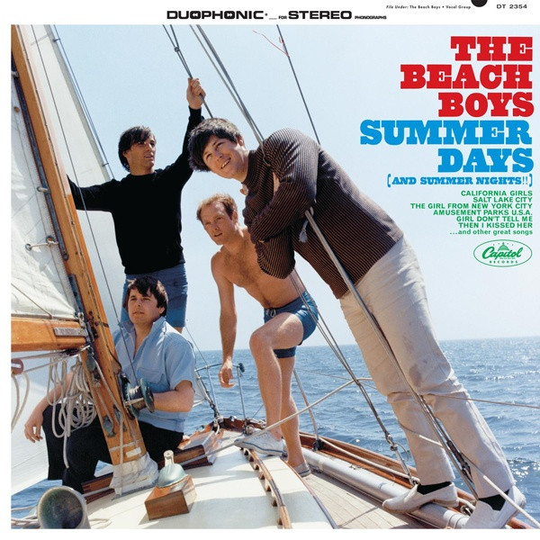

# Summer Days (And Summer Nights!!)

By The Beach Boys

## Album Data

[Discogs URL](https://www.discogs.com/release/2739189-The-Beach-Boys-Summer-Days-And-Summer-Nights)

- Label: Capitol Records
- Formats: Vinyl, LP, Album, Reissue, Mono
- Genres: Rock, Surf
- Rating: 4.23
- Released: 2010
- Year: 1965
- Release ID: 2739189
- Media condition: 
- Sleeve condition: 
- Speed: 
- Weight: 
- Notes: 

## Album Tracks

| **Position** | **Title** | **Duration** |
|--------------|-----------|--------------|
| A1 | **The Girl From New York City** | 1:53 |
| A2 | **Amusement Parks U.S.A.** | 2:31 |
| A3 | **Then I Kissed Her** | 2:15 |
| A4 | **Salt Lake City** | 2:00 |
| A5 | **Girl Don't Tell Me** | 2:17 |
| A6 | **Help Me, Rhonda** | 2:45 |
| B1 | **California Girls** | 2:37 |
| B2 | **Let Him Run Wild** | 2:21 |
| B3 | **You're So Good To Me** | 2:14 |
| B4 | **Summer Means New Love** | 1:58 |
| B5 | **I'm Bugged At My Ol' Man** | 2:15 |
| B6 | **And Your Dream Comes True** | 1:02 |

## Artist Roles

| **Name** | **Role** |
|----------|----------|
| **Alan Jardine** | Lead Vocals |
| **Brian Wilson** | Lead Vocals |
| **Mike Love** | Lead Vocals |
| **Alan Jardine** | Performer |
| **Brian Wilson** | Performer |
| **Carl Wilson** | Performer |
| **Dennis Wilson (2)** | Performer |
| **Mike Love** | Performer |
| **Brian Wilson** | Written-By |
| **Mike Love** | Written-By |

