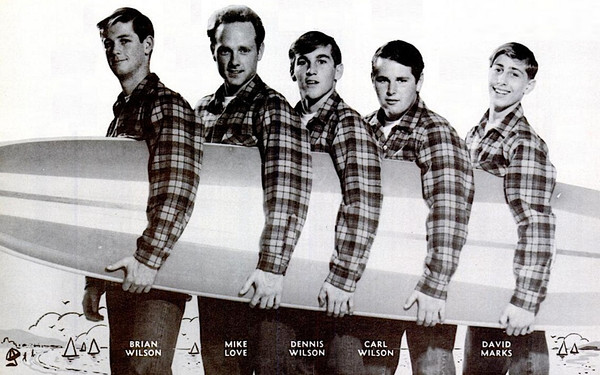

# The Beach Boys

## Artist Profile

The Beach Boys are an American rock band from Hawthorne, California that formed in 1961. Their vocal harmonies, early surf songs, and innovative recordings remain a massive influence on popular music today.

## Artist Links

- [https://www.thebeachboys.com/](https://www.thebeachboys.com/)
- [https://www.udiscovermusic.com/artist/the-beach-boys/](https://www.udiscovermusic.com/artist/the-beach-boys/)
- [https://www.facebook.com/thebeachboys](https://www.facebook.com/thebeachboys)
- [https://myspace.com/thebeachboys](https://myspace.com/thebeachboys)
- [https://twitter.com/TheBeachBoys](https://twitter.com/TheBeachBoys)
- [https://en.wikipedia.org/wiki/The_Beach_Boys](https://en.wikipedia.org/wiki/The_Beach_Boys)
- [https://www.youtube.com/user/TheBeachBoysVEVO](https://www.youtube.com/user/TheBeachBoysVEVO)
- [https://www.instagram.com/thebeachboys/](https://www.instagram.com/thebeachboys/)

## See also

- [Dance, Dance, Dance](Dance__Dance__Dance.md)
- [Darlin' / Here Today](Darlin_-_Here_Today.md)
- [Good Vibrations](Good_Vibrations.md)
- [Holland](Holland.md)
- [Love You](Love_You.md)
- [Pet Sounds](Pet_Sounds.md)
- [Summer Days (And Summer Nights!!)](Summer_Days_And_Summer_Nights!!.md)
