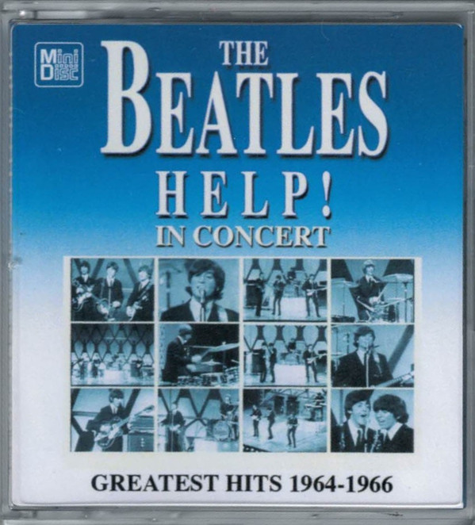

# Help! In Concert

By The Beatles

## Album Data

[Discogs URL](https://www.discogs.com/release/9956098-The-Beatles-Help-In-Concert)

- Label: Coda Publishing
- Formats: Vinyl, LP, Limited Edition, Unofficial Release, Mono
- Genres: Rock, Classic Rock, Beat
- Rating: 4.34
- Released: 2016
- Year: 2016
- Release ID: 9956098
- Media condition: 
- Sleeve condition: 
- Speed: 
- Weight: 
- Notes: 

## Album Tracks

| **Position** | **Title** | **Duration** |
|--------------|-----------|--------------|
| A1 | **A Hard Day's Night** |  |
| A2 | **Things We Said Today** |  |
| A3 | **You Can't Do That** |  |
| A4 | **If I Fell** |  |
| A5 | **Long Tall Sally** |  |
| A6 | **I Feel Fine** |  |
| A7 | **I'm Down** |  |
| A8 | **Ticket To Ride** |  |
| A9 | **Yesterday** |  |
| A10 | **Help!** |  |
| B1 | **Act Naturally** |  |
| B2 | **Twist And Shout** |  |
| B3 | **She's A Woman** |  |
| B4 | **I'm A Loser** |  |
| B5 | **Can't Buy Me Love** |  |
| B6 | **Baby's In Black** |  |
| B7 | **I Wanna Be Your Man** |  |
| B8 | **Everybody's Trying To Be My Baby** |  |
| B9 | **Rock 'N' Roll Music** |  |
| B10 | **Long Tall Sally** |  |

