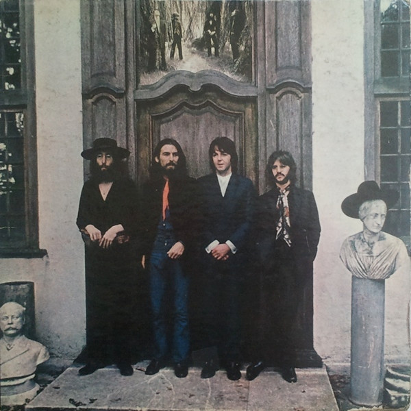

# Hey Jude

By The Beatles

## Album Data

[Discogs URL](https://www.discogs.com/release/3027731-The-Beatles-Hey-Jude)

- Label: Apple Records
- Formats: Vinyl, LP, Compilation
- Genres: Rock, Rock & Roll, Beat
- Rating: 4.32
- Released: 1971
- Year: 1970
- Release ID: 3027731
- Media condition: 
- Sleeve condition: 
- Speed: 
- Weight: 
- Notes: 

## Album Tracks

| **Position** | **Title** | **Duration** |
|--------------|-----------|--------------|
| A1 | **Can't Buy Me Love** | 2:19 |
| A2 | **I Should Have Known Better** | 2:39 |
| A3 | **Paperback Writer** | 2:14 |
| A4 | **Rain** | 2:58 |
| A5 | **Lady Madonna** | 2:14 |
| A6 | **Revolution** | 3:21 |
| B1 | **Hey Jude** | 7:06 |
| B2 | **Old Brown Shoe** | 3:16 |
| B3 | **Don't Let Me Down** | 3:30 |
| B4 | **Ballad Of John & Yoko** | 2:55 |

## Artist Roles

| **Name** | **Role** |
|----------|----------|
| **Sam Feldman** | Mastered By |
| **George Martin** | Producer |
| **Lennon-McCartney** | Written-By |

