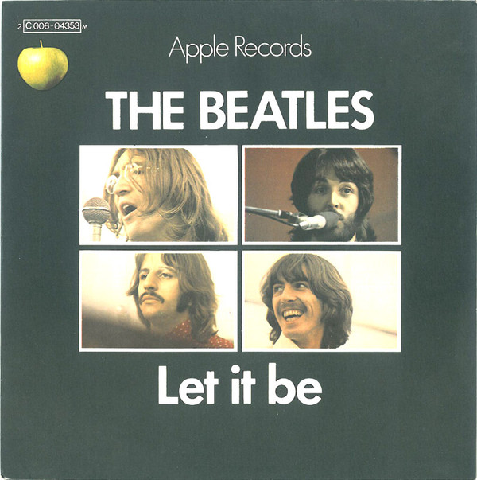

# Let It Be

By The Beatles

## Album Data

[Discogs URL](https://www.discogs.com/release/4541526-The-Beatles-Let-It-Be)

- Label: Apple Records
- Formats: Vinyl, LP, Album, Stereo
- Genres: Rock, Soft Rock, Beat, Classic Rock
- Rating: 4.38
- Released: 1970-05-18
- Year: 1970
- Release ID: 4541526
- Media condition: 
- Sleeve condition: 
- Speed: 
- Weight: 
- Notes: 

## Album Tracks

| **Position** | **Title** | **Duration** |
|--------------|-----------|--------------|
| A1 | **Two Of Us** | 3:33 |
| A2 | **I Dig A Pony** | 3:55 |
| A3 | **Across The Universe** | 3:51 |
| A4 | **I Me Mine** | 2:25 |
| A5 | **Dig It** | 0:51 |
| A6 | **Let It Be** | 4:01 |
| A7 | **Maggie Mae** | 0:39 |
| B1 | **I've Got A Feeling** | 3:38 |
| B2 | **One After 909** | 2:52 |
| B3 | **The Long And Winding Road** | 3:40 |
| B4 | **For You Blue** | 2:33 |
| B5 | **Get Back** | 3:09 |

## Artist Roles

| **Name** | **Role** |
|----------|----------|
| **John Kosh** | Design |
| **Billy Preston** | Keyboards [Uncredited] |
| **Sam Feldman** | Lacquer Cut By |
| **Ethan Russell** | Photography By [Photographs By] |
| **Phil Spector** | Producer [Reproduced For Disc] |
| **George Martin** | Producer [Uncredited, Original Recordings] |

