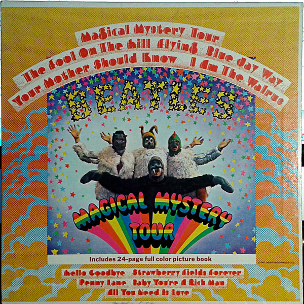

# Magical Mystery Tour

By The Beatles

## Album Data

[Discogs URL](https://www.discogs.com/release/7909706-The-Beatles-Magical-Mystery-Tour)

- Label: Capitol Records
Capitol Records
Capitol Records
- Formats: Vinyl, LP, Album, Reissue, Stereo
- Genres: Rock, Stage & Screen, Soundtrack, Pop Rock, Psychedelic Rock
- Rating: 4.29
- Released: 1969
- Year: 1967
- Release ID: 7909706
- Media condition: 
- Sleeve condition: 
- Speed: 
- Weight: 
- Notes: 

## Album Tracks

| **Position** | **Title** | **Duration** |
|--------------|-----------|--------------|
| A1 | **Magical Mystery Tour** | 2:48 |
| A2 | **The Fool On The Hill** | 3:00 |
| A3 | **Flying** | 2:16 |
| A4 | **Blue Jay Way** | 3:50 |
| A5 | **Your Mother Should Know** | 2:33 |
| A6 | **I Am The Walrus** | 4:35 |
| B1 | **Hello Goodbye** | 3:24 |
| B2 | **Strawberry Fields Forever** | 4:05 |
| B3 | **Penny Lane** | 2:57 |
| B4 | **Baby You're A Rich Man** | 3:07 |
| B5 | **All You Need Is Love** | 3:57 |

## Artist Roles

| **Name** | **Role** |
|----------|----------|
| **Bob Gibson (7)** | Artwork [Drawings] |
| **Tony Barrow** | Liner Notes [Book Editor] |
| **John Kelly (5)** | Photography By |
| **George Martin** | Producer |

