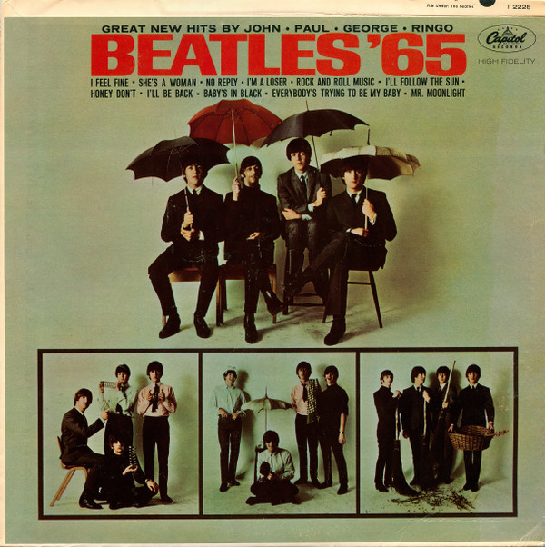

# Beatles '65

By The Beatles

## Album Data

[Discogs URL](https://www.discogs.com/release/7482841-The-Beatles-Beatles-65)

- Label: Capitol Records
Capitol Records
- Formats: Vinyl, LP, Album, Mono
- Genres: Rock, Pop, Beat, Rock & Roll
- Rating: 4.05
- Released: 1964-12-15
- Year: 1964
- Release ID: 7482841
- Media condition: 
- Sleeve condition: 
- Speed: 
- Weight: 
- Notes: 

## Album Tracks

| **Position** | **Title** | **Duration** |
|--------------|-----------|--------------|
| A1 | **No Reply** | 2:15 |
| A2 | **I'm A Loser** | 2:31 |
| A3 | **Baby's In Black** | 2:02 |
| A4 | **Rock And Roll Music** | 2:02 |
| A5 | **I'll Follow The Sun** | 1:46 |
| A6 | **Mr. Moonlight** | 2:35 |
| B1 | **Honey Don't** | 2:56 |
| B2 | **I'll Be Back** | 2:22 |
| B3 | **She's A Woman** | 2:57 |
| B4 | **I Feel Fine** | 2:20 |
| B5 | **Everybody's Trying To Be My Baby** | 2:24 |

## Artist Roles

| **Name** | **Role** |
|----------|----------|
| **George Harrison** | Performer |
| **John Lennon** | Performer |
| **Paul McCartney** | Performer |
| **Ringo Starr** | Performer |
| **George Martin** | Producer |

