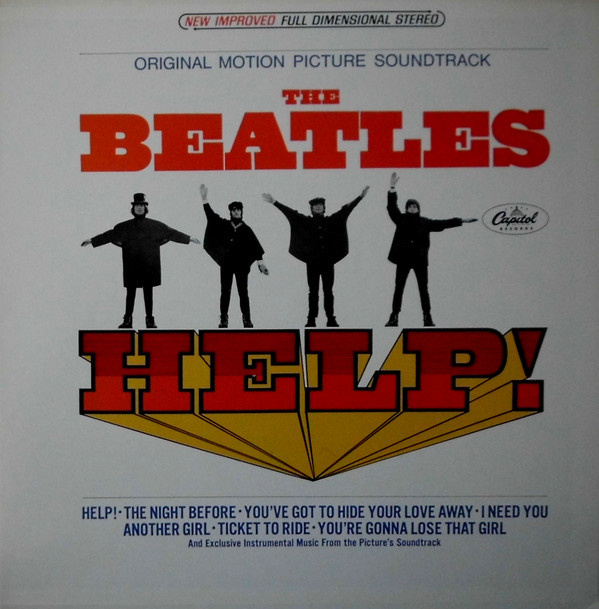

# Help! (Original Motion Picture Soundtrack)

By The Beatles

## Album Data

[Discogs URL](https://www.discogs.com/release/3673507-The-Beatles-Help-Original-Motion-Picture-Soundtrack)

- Label: Capitol Records
Capitol Records
- Formats: Vinyl, LP, Album, Mono
- Genres: Rock, Stage & Screen, Soundtrack, Rock & Roll
- Rating: 4.05
- Released: 1965-08-13
- Year: 1965
- Release ID: 3673507
- Media condition: 
- Sleeve condition: 
- Speed: 
- Weight: 
- Notes: 

## Album Tracks

| **Position** | **Title** | **Duration** |
|--------------|-----------|--------------|
| A1 | **Help!** | 2:35 |
| A2 | **The Night Before** | 2:33 |
| A3 | **From Me To You Fantasy** | 2:03 |
| A4 | **You've Got To Hide Your Love Away** | 2:08 |
| A5 | **I Need You** | 2:28 |
| A6 | **In The Tyrol** | 2:21 |
| B1 | **Another Girl** | 2:02 |
| B2 | **Another Hard Day's Night** | 2:28 |
| B3 | **Ticket To Ride** | 3:03 |
| B4 | **The Bitter End / You Can't Do That** | 2:20 |
| B5 | **You're Gonna Lose That Girl** | 2:18 |
| B6 | **The Chase** | 2:24 |

## Artist Roles

| **Name** | **Role** |
|----------|----------|
| **John Lennon** | Acoustic Guitar |
| **John Lennon** | Acoustic Guitar |
| **George Harrison** | Backing Vocals |
| **John Lennon** | Backing Vocals |
| **Paul McCartney** | Backing Vocals |
| **Paul McCartney** | Bass |
| **Ringo Starr** | Drums |
| **Norman Smith** | Engineer |
| **George Harrison** | Guitar [Lead] |
| **John Lennon** | Lead Vocals |
| **Dave Dexter, Jr.** | Producer |
| **George Martin** | Producer |
| **Ken Thorne** | Score |

