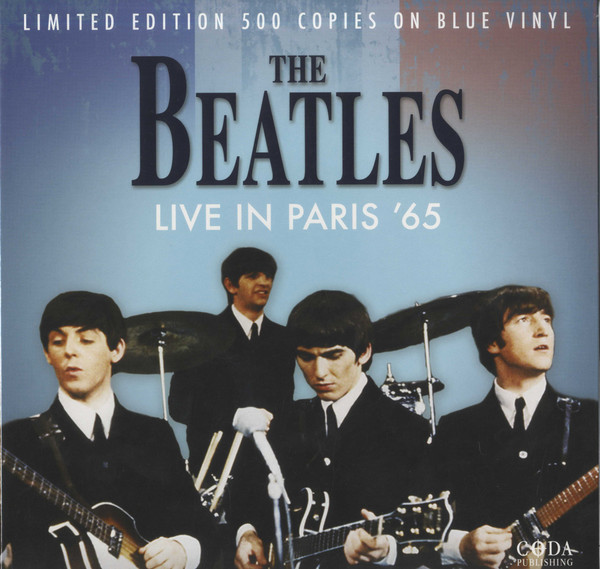

# Live In Paris '65

By The Beatles

## Album Data

[Discogs URL](https://www.discogs.com/release/8131788-The-Beatles-Live-In-Paris-65)

- Label: Coda Publishing
- Formats: Vinyl, LP, Limited Edition, Remastered, Unofficial Release
- Genres: Rock, Pop, Classic Rock, Beat
- Rating: 4.32
- Released: 2016
- Year: 1989
- Release ID: 8131788
- Media condition: 
- Sleeve condition: 
- Speed: 
- Weight: 
- Notes: 

## Album Tracks

| **Position** | **Title** | **Duration** |
|--------------|-----------|--------------|
| A1 | **Twist And Shout** | 1:40 |
| A2 | **She's A Woman** | 3:08 |
| A3 | **I'm A Loser** | 2:31 |
| A4 | **Can't Buy Me love** | 2:24 |
| A5 | **Baby's In Black** | 2:27 |
| A6 | **I Wanna Be Your Man** | 2:36 |
| B1 | **A Hard Day's Night** | 2:45 |
| B2 | **Everybody's Trying To Be My Baby** | 2:27 |
| B3 | **Rock 'N' Roll Music** | 2:24 |
| B4 | **Ticket To Ride** | 4:01 |
| B5 | **Long Tall Sally** | 2:24 |

