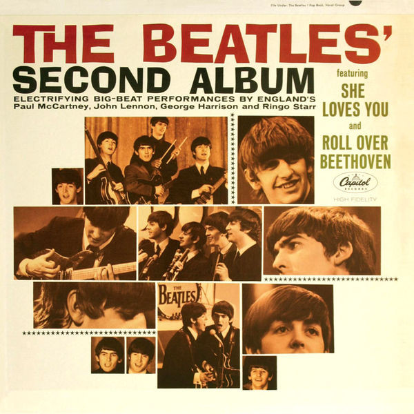

# The Beatles' Second Album

By The Beatles

## Album Data

[Discogs URL](https://www.discogs.com/release/801261-The-Beatles-The-Beatles-Second-Album)

- Label: Capitol Records
Capitol Records
- Formats: Vinyl, LP, Album, Mono
- Genres: Rock, Pop, Beat, Rock & Roll
- Rating: 4.17
- Released: 1964-04-10
- Year: 1964
- Release ID: 801261
- Media condition: 
- Sleeve condition: 
- Speed: 
- Weight: 
- Notes: 

## Album Tracks

| **Position** | **Title** | **Duration** |
|--------------|-----------|--------------|
| A1 | **Roll Over Beethoven** | 2:44 |
| A2 | **Thank You Girl** | 2:01 |
| A3 | **You Really Got A Hold On Me** | 2:58 |
| A4 | **Devil In Her Heart** | 2:23 |
| A5 | **Money (That's What I Want)** | 2:47 |
| A6 | **You Can't Do That** | 2:33 |
| B1 | **Long Tall Sally** |  |
| B2 | **I Call Your Name** |  |
| B3 | **Please Mr. Postman** | 2:34 |
| B4 | **I'll Get You** | 2:04 |
| B5 | **She Loves You** | 2:19 |

## Artist Roles

| **Name** | **Role** |
|----------|----------|
| **Joe Covello** | Photography By |
| **George Martin** | Producer |

