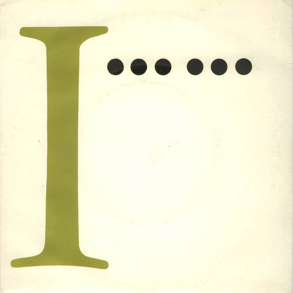

# Never In A Million Years

By The Boomtown Rats

## Album Data

[Discogs URL](https://www.discogs.com/release/1857732-The-Boomtown-Rats-Never-In-A-Million-Years)

- Label: Mercury
- Formats: Vinyl, 7", Single, 45 RPM
- Genres: Rock, Pop Rock
- Rating: 3.33
- Released: 1981-11-20
- Year: 1981
- Release ID: 1857732
- Media condition: 
- Sleeve condition: 
- Speed: 
- Weight: 
- Notes: 

## Album Tracks

| **Position** | **Title** | **Duration** |
|--------------|-----------|--------------|
| A | **Never In A Million Years** | 3:51 |
| B | **Don't Talk To Me** | 2:54 |

## Artist Roles

| **Name** | **Role** |
|----------|----------|
| **Bob Geldof** | Written-By |

