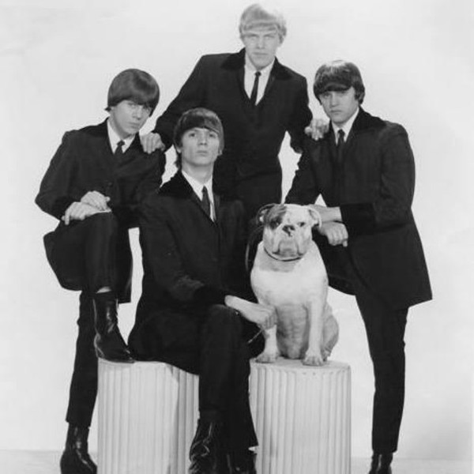

# The British Walkers

## Artist Profile

The British Walkers weren’t actually British. They were an American band whose sound was influenced by The Rolling Stones, The Who, and The Kinks. Forming in 1964, The British Walkers lasted only four years, breaking up in 1968.

## Artist Links

- [https://thebritishwalkers.blogspot.com/](https://thebritishwalkers.blogspot.com/)

## See also

- [Shake / That Was Yesterday](Shake_-_That_Was_Yesterday.md)
