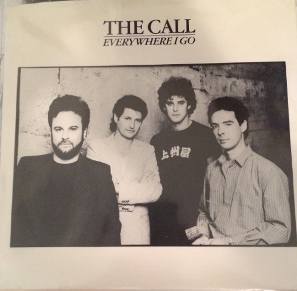

# Everywhere I Go

By The Call

## Album Data

[Discogs URL](https://www.discogs.com/release/4554943-The-Call-Everywhere-I-Go)

- Label: Elektra
- Formats: Vinyl, 7", 45 RPM, Stereo
- Genres: Rock, Alternative Rock
- Rating: 3
- Released: 1986
- Year: 1986
- Release ID: 4554943
- Media condition: 
- Sleeve condition: 
- Speed: 
- Weight: 
- Notes: 

## Album Tracks

| **Position** | **Title** | **Duration** |
|--------------|-----------|--------------|
| A | **Everywhere I Go** | 3:51 |
| B | **Tore The Old Place Down** | 4:12 |

## Artist Roles

| **Name** | **Role** |
|----------|----------|
| **The Call** | Producer |
| **Michael Been** | Producer, Written-By |

