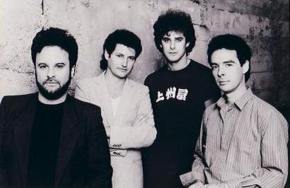

# The Call

## Artist Profile

The Call formed in Santa Cruz in 1980 by vocalist/guitarist Michael Been, drummer/percussionist Scott Musick, bassist Greg Freeman, and guitarist Tom Ferrier. Michael Been died on August 19, 2010 after suffering a heart attack backstage at the Pukkelpop music festival in Hasselt, Belgium, where he was working as sound engineer for his son's band Black Rebel Motorcycle Club.

## Artist Links

- [https://the-call-band.com/](https://the-call-band.com/)
- [https://www.facebook.com/TheCallBandOfficial/](https://www.facebook.com/TheCallBandOfficial/)
- [https://twitter.com/thecallband](https://twitter.com/thecallband)
- [https://www.instagram.com/official_call_band/](https://www.instagram.com/official_call_band/)
- [https://en.wikipedia.org/wiki/The_Call_(band)](https://en.wikipedia.org/wiki/The_Call_(band))

## See also

- [Everywhere I Go](Everywhere_I_Go.md)
