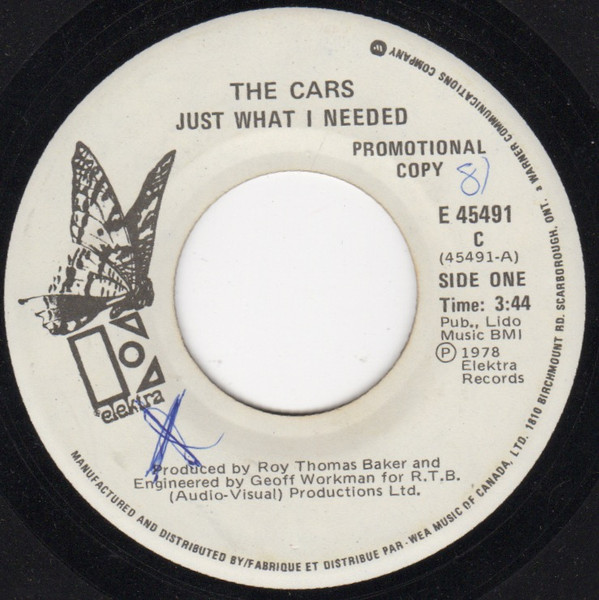

# Just What I Needed

By The Cars

## Album Data

[Discogs URL](https://www.discogs.com/release/611116-The-Cars-Just-What-I-Needed)

- Label: Elektra
- Formats: Vinyl, 7", Single
- Genres: Rock, Pop Rock
- Rating: 4.54
- Released: 1978-05-29
- Year: 1978
- Release ID: 611116
- Media condition: 
- Sleeve condition: 
- Speed: 
- Weight: 
- Notes: 

## Album Tracks

| **Position** | **Title** | **Duration** |
|--------------|-----------|--------------|
| A | **Just What I Needed** | 3:44 |
| B | **I'm In Touch With Your World** | 3:31 |

## Artist Roles

| **Name** | **Role** |
|----------|----------|
| **Geoff Workman** | Engineer |
| **Roy Thomas Baker** | Producer |
| **Ric Ocasek** | Written-By |

