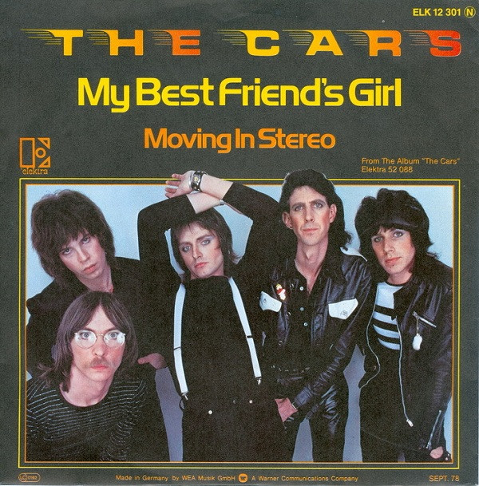

# My Best Friend's Girl

By The Cars

## Album Data

[Discogs URL](https://www.discogs.com/release/3055175-The-Cars-My-Best-Friends-Girl)

- Label: Elektra
- Formats: Vinyl, 7", 45 RPM, Single
- Genres: Rock, New Wave
- Rating: 4.64
- Released: 1978
- Year: 1978
- Release ID: 3055175
- Media condition: 
- Sleeve condition: 
- Speed: 
- Weight: 
- Notes: 

## Album Tracks

| **Position** | **Title** | **Duration** |
|--------------|-----------|--------------|
| A | **My Best Friend's Girl** | 3:40 |
| B | **Don't Cha Stop** | 3:01 |

