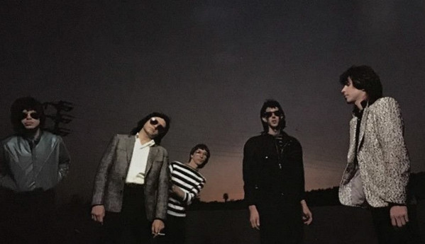

# The Cars

## Artist Profile

American New Wave rock group from Boston, Massachusetts. Formed in 1976. 

Released their first single and LP two years later. Initially a guitar-driven rock act with some progressive keyboard accompaniment, after their first album they rapidly moved toward a heavily synth-based, pop-rock sound, then disbanded in 1988. Line-up: Ric Ocasek (vocals, guitar), Benjamin Orr (vocals, bass), Elliot Easton (guitar), Greg Hawkes (keyboards, sax, guitar) and David Robinson (drums).

The Cars were one of the most successful American New Wave bands to emerge in the late 1970s, and in the ensuing decade the band racked up a string of platinum albums and Top 40 singles.

In 2006, Greg Hawkes and Elliot Easton, together with Todd Rundgren and Kasim Sulton (both of Utopia) and Prairie Prince (formerly of The Tubes) formed The New Cars and played mainly original Cars material live.

In 2011 The Cars (without Benjamin Orr who had passed away on October 4, 2000) released a new album and went on tour again with Greg Hawkes taking over on bass and Ric Ocasek as sole lead singer.

Inducted into the Rock and Roll Hall of Fame in 2018, and reunited once more to perform at the induction ceremony. Ric Ocasek passed away on September 15, 2019.

## Artist Links

- [http://thecars.org/](http://thecars.org/)
- [https://myspace.com/thecarsunlocked](https://myspace.com/thecarsunlocked)
- [https://en.wikipedia.org/wiki/The_Cars](https://en.wikipedia.org/wiki/The_Cars)
- [https://www.facebook.com/TheCars](https://www.facebook.com/TheCars)

## See also

- [Just What I Needed](Just_What_I_Needed.md)
- [My Best Friend's Girl](My_Best_Friends_Girl.md)
