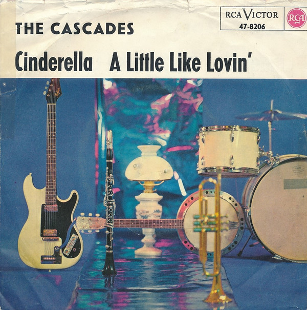

# Cinderella / A Little Like Lovin'

By The Cascades

## Album Data

[Discogs URL](https://www.discogs.com/release/5163192-The-Cascades-Cinderella-A-Little-Like-Lovin)

- Label: RCA Victor
- Formats: Vinyl, 7", 45 RPM, Single
- Genres: Pop, Vocal
- Rating: 5
- Released: 1963
- Year: 1963
- Release ID: 5163192
- Media condition: 
- Sleeve condition: 
- Speed: 
- Weight: 
- Notes: 

## Album Tracks

| **Position** | **Title** | **Duration** |
|--------------|-----------|--------------|
| A | **Cinderella ** | 2:33 |
| B | **A Little Like Lovin'** | 2:08 |

## Artist Roles

| **Name** | **Role** |
|----------|----------|
| **Perry Botkin Jr.** | Arranged By, Conductor |
| **Joe Reisman** | Producer |

