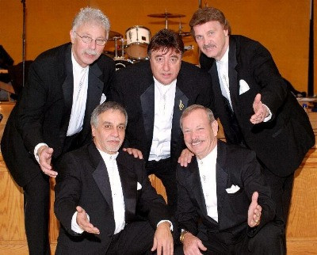

# The Cascades

## Artist Profile

Harmony pop from San Diego. Formed in 1960 as an instrumental band named The SilverSounds and then became the The Thundernotes, Changed their name and sound when singer John Gummoe joined the band. They had one big hit with their song "Rhythm Of The Rain".

## Artist Links

- [http://en.wikipedia.org/wiki/The_Cascades_(band)](http://en.wikipedia.org/wiki/The_Cascades_(band))
- [http://www.billboard.com/artist/391344/cascades/biography](http://www.billboard.com/artist/391344/cascades/biography)
- [https://www.sandiegoreader.com/bands/cascades/](https://www.sandiegoreader.com/bands/cascades/)

## See also

- [Cinderella / A Little Like Lovin'](Cinderella_-_A_Little_Like_Lovin.md)
