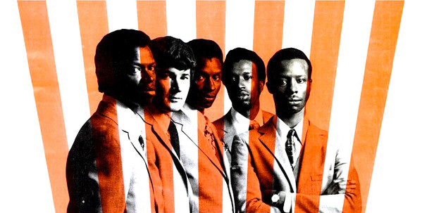

# The Chambers Brothers

## Artist Profile

American rock-soul group. Best remembered for their 1968 hit “Time Has Come Today”.

## Artist Links

- [http://en.wikipedia.org/wiki/The_Chambers_Brothers](http://en.wikipedia.org/wiki/The_Chambers_Brothers)
- [http://www.classicbands.com/chambers.html](http://www.classicbands.com/chambers.html)
- [http://www.allmusic.com/artist/the-chambers-brothers-mn0000057124](http://www.allmusic.com/artist/the-chambers-brothers-mn0000057124)
- [http://www.whosampled.com/search/?q=The+Chambers+Brothers](http://www.whosampled.com/search/?q=The+Chambers+Brothers)
- [https://www.imdb.com/name/nm2043900/](https://www.imdb.com/name/nm2043900/)

## See also

- [The Time Has Come](The_Time_Has_Come.md)
