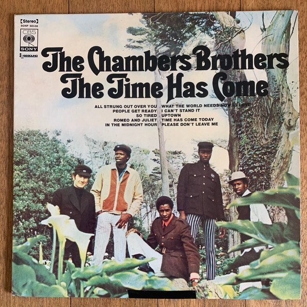

# The Time Has Come

By The Chambers Brothers

## Album Data

[Discogs URL](https://www.discogs.com/release/645128-The-Chambers-Brothers-The-Time-Has-Come)

- Label: Columbia
- Formats: Vinyl, LP, Album, Stereo
- Genres: Rock, Funk / Soul, Psychedelic Rock, Soul, Psychedelic
- Rating: 4.09
- Released: 1967
- Year: 1967
- Release ID: 645128
- Media condition: 
- Sleeve condition: 
- Speed: 
- Weight: 
- Notes: 

## Album Tracks

| **Position** | **Title** | **Duration** |
|--------------|-----------|--------------|
| A1 | **All Strung Out Over You** |  |
| A2 | **People Get Ready** |  |
| A3 | **I Can't Stand It** |  |
| A4 | **Romeo And Juliet** |  |
| A5 | **In The Midnight Hour** |  |
| A6 | **So Tired** |  |
| B1 | **Uptown** |  |
| B2 | **Please Don't Leave Me** |  |
| B3 | **What The World Needs Now Is Love** |  |
| B4 | **Time Has Come Today** |  |

## Artist Roles

| **Name** | **Role** |
|----------|----------|
| **Brian Keenan** | Performer |
| **George Chambers (3)** | Performer |
| **Joseph Chambers** | Performer |
| **Lester Chambers** | Performer |
| **Willie Chambers** | Performer |
| **Jim Marshall (3)** | Photography By |
| **David Rubinson** | Producer |

