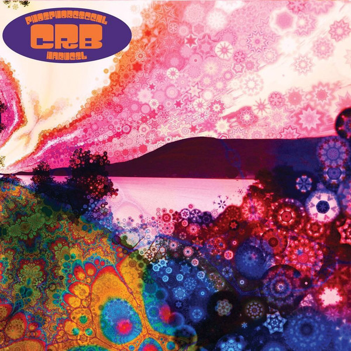

# Phosphorescent Harvest

By The Chris Robinson Brotherhood

## Album Data

[Discogs URL](https://www.discogs.com/release/5647581-CRB-Phosphorescent-Harvest)

- Label: Silver Arrow
- Formats: Vinyl
Vinyl
Vinyl
All Media, LP, LP, 7", Album
- Genres: Rock, Blues, Blues Rock, Psychedelic Rock
- Rating: 4.28
- Released: 2014-04-29
- Year: 2014
- Release ID: 5647581
- Media condition: 
- Sleeve condition: 
- Speed: 
- Weight: 
- Notes: 

## Album Tracks

| **Position** | **Title** | **Duration** |
|--------------|-----------|--------------|
| A1 | **Shore Power** | 4:41 |
| A2 | **About A Stranger** | 5:08 |
| A3 | **Meanwhile In The Gods....** | 6:08 |
| B1 | **Badlands Here We Come** | 5:25 |
| B2 | **Clear Blue Sky & The Good Doctor** | 7:47 |
| C1 | **Beggar's Moon** | 6:56 |
| C2 | **Wanderer's Lament** | 5:38 |
| C3 | **Tornado** | 5:04 |
| D1 | **Jump The Turnstiles** | 6:40 |
| D2 | **Burn Slow** | 7:14 |
| E | **Humboldt Windchimes** | 4:37 |
| F | **Star Crossed Lonely Sailor** | 5:35 |

## Artist Roles

| **Name** | **Role** |
|----------|----------|
| **Mark Dutton** | Bass, Vocals |
| **George Sluppick** | Drums |
| **Chris Robinson (2)** | Guitar, Vocals, Written-By |
| **Neal Casal** | Guitar, Vocals, Written-By |
| **Adam MacDougall** | Keyboards, Vocals |
| **JJ Golden** | Mastered By |
| **Thom Monahan** | Producer, Engineer, Mixed By |

