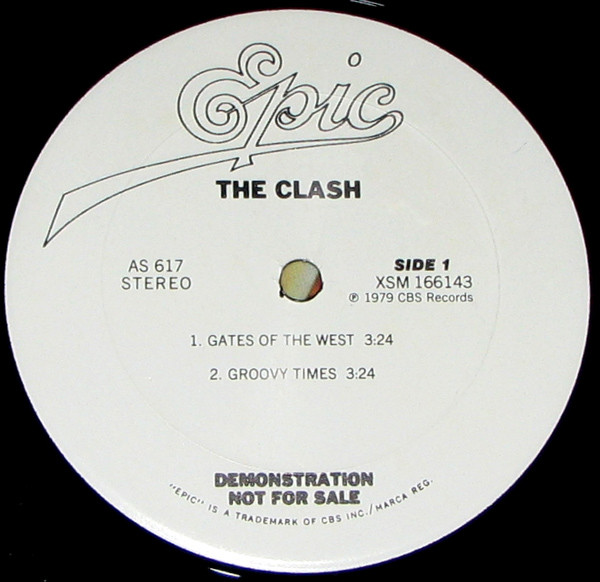

# Gates Of The West

By The Clash

## Album Data

[Discogs URL](https://www.discogs.com/release/2105476-The-Clash-Gates-Of-The-West)

- Label: Epic
- Formats: Vinyl, 12", 33 ⅓ RPM, Promo
- Genres: Rock, Punk
- Rating: 4.35
- Released: 1979
- Year: 1979
- Release ID: 2105476
- Media condition: 
- Sleeve condition: 
- Speed: 
- Weight: 
- Notes: 

## Album Tracks

| **Position** | **Title** | **Duration** |
|--------------|-----------|--------------|
| A1 | **Gates Of The West** | 3:24 |
| A2 | **Groovy Times** | 3:24 |
| B | **I Fought The Law** | 2:38 |

