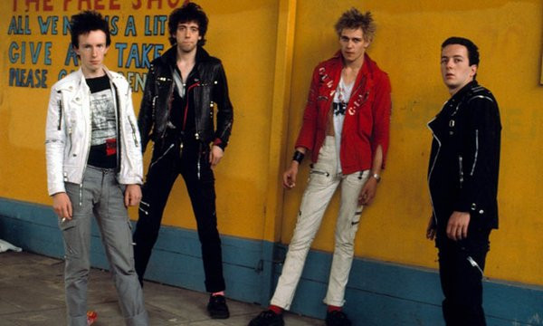

# The Clash

## Artist Profile

Influential British punk group from west and south London, active between 1976 and 1985. Adding catchy sloganistic socio-political lyrics to their brand of garage rock 'n' roll, the band soon explored wider musical horizons than most of their contemporaries, incorporating reggae, dub, rockabilly, hip hop and funk influences into their music and a whole lot more. 
The US saw the 2nd album "Give 'Em Enough Rope" released before the first to coincide with the band's first transatlantic tour in early 1979 (and like in Japan and in Canada) the 1st LP "The Clash" was soon repackaged with an updated track list and the addition of a free 7" "Groovy Times" / "Gates Of The West" which wasn't released separately. A year later they were receiving worldwide acclaim with their classic double album "London Calling".
Inducted into Rock And Roll Hall of Fame in 2003 (Performer), their classic line-up comprised Joe Strummer (vocals / guitar, b. John Graham Mellor August 21, 1952 Ankara, Turkey d. Dec 22, 2002 Broomfield, Somerset, England), Paul Simonon (bass, b. December 15, 1955), Mick Jones (guitar, b. June 26, 1955) and Nicky "Topper" Headon (drums, b. May 30, 1955).

## Artist Links

- [http://www.theclash.com](http://www.theclash.com)
- [http://www.facebook.com/theclash](http://www.facebook.com/theclash)
- [http://www.instagram.com/the_clash](http://www.instagram.com/the_clash)
- [http://myspace.com/theclash](http://myspace.com/theclash)
- [http://twitter.com/TheClash](http://twitter.com/TheClash)
- [http://www.whosampled.com/The-Clash](http://www.whosampled.com/The-Clash)
- [http://en.wikipedia.org/wiki/The_Clash](http://en.wikipedia.org/wiki/The_Clash)
- [http://www.youtube.com/channel/UCWfAZudbGLAyrrEBaGuslNA](http://www.youtube.com/channel/UCWfAZudbGLAyrrEBaGuslNA)

## See also

- [Gates Of The West](Gates_Of_The_West.md)
