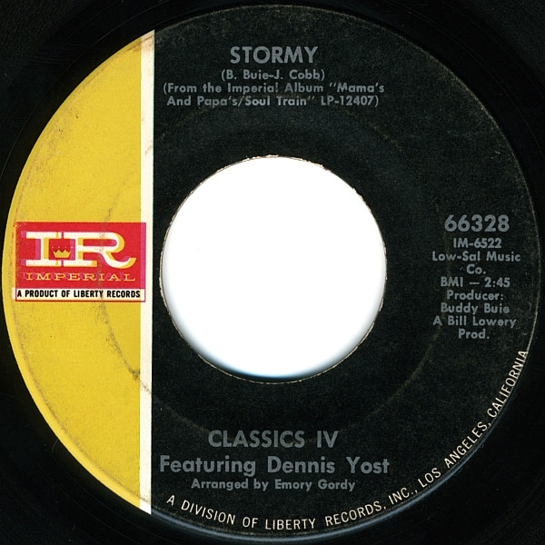

# Stormy / 24 Hours Of Loneliness

By The Classics IV

## Album Data

[Discogs URL](https://www.discogs.com/release/5615352-Classics-IV-Featuring-Dennis-Yost-Stormy-24-Hours-Of-Loneliness)

- Label: Imperial
- Formats: Vinyl, 7", Single, 45 RPM
- Genres: Rock, Soft Rock, Pop Rock
- Rating: 4.4
- Released: 1968-10-00
- Year: 1968
- Release ID: 5615352
- Media condition: 
- Sleeve condition: 
- Speed: 
- Weight: 
- Notes: 

## Album Tracks

| **Position** | **Title** | **Duration** |
|--------------|-----------|--------------|
| A | **Stormy** | 2:45 |
| B | **24 Hours Of Loneliness** | 2:05 |

## Artist Roles

| **Name** | **Role** |
|----------|----------|
| **Emory Gordy, Jr.** | Arranged By |
| **Buddy Buie** | Producer |
| **Dennis Yost** | Vocals [Featuring] |
| **Buddy Buie** | Written-By |
| **James B. Cobb Jr.** | Written-By |

