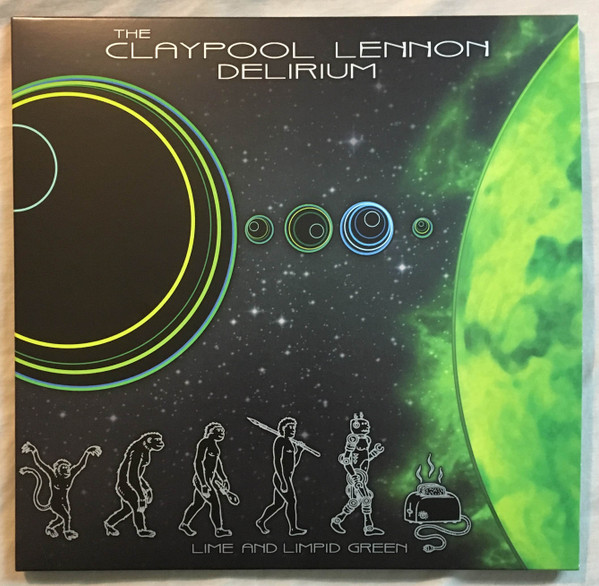

# Lime And Limpid Green 

By The Claypool Lennon Delirium

## Album Data

[Discogs URL](https://www.discogs.com/release/10172121-The-Claypool-Lennon-Delirium-Lime-And-Limpid-Green-)

- Label: ATO Records
Prawn Song
- Formats: Vinyl, 10", EP, Limited Edition, Misprint
- Genres: Rock, Alternative Rock, Indie Rock, Prog Rock, Psychedelic Rock
- Rating: 4.63
- Released: 2017-04-22
- Year: 2017
- Release ID: 10172121
- Media condition: 
- Sleeve condition: 
- Speed: 
- Weight: 
- Notes: 

## Album Tracks

| **Position** | **Title** | **Duration** |
|--------------|-----------|--------------|
| A1 | **Astronomy Domine** |  |
| A2 | **Boris The Spider** |  |
| B1 | **The Court Of The Crimson King** |  |
| B2 | **Satori** |  |

## Artist Roles

| **Name** | **Role** |
|----------|----------|
| **Ben Wittholz** | Artwork By [Original Cover Art & Layout By] |
| **Les Claypool** | Bass, Vocals |
| **Paulo Baldi** | Drums |
| **Les Claypool** | Engineer |
| **Sean Lennon** | Guitar, Vocals |
| **Pete Drungle** | Keyboards |
| **Stephen Marcussen** | Mastered By |
| **Les Claypool** | Producer |
| **Sean Lennon** | Producer |

