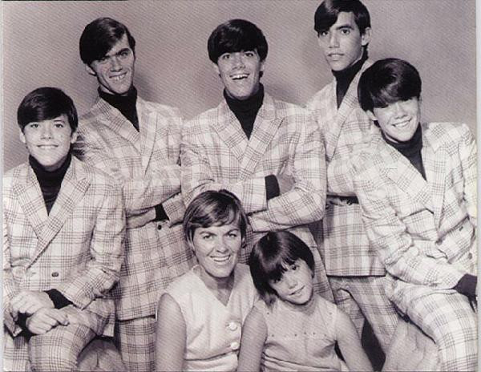

# The Cowsills

## Artist Profile

The Cowsills are an American singing group from Newport, Rhode Island who were the inspiration for the television series, The Partridge Family. The band was formed in the spring of 1965 by brothers Bill Cowsill, Bob Cowsill and Barry Cowsill, then shortly after, added John Cowsill. After their initial success, the brothers were later joined by their siblings Susan Cowsill and Paul Cowsill and their mother, Barbara. Bob's twin brother Richard (who died on 08-Jul-2014) was the road manager.

## Artist Links

- [http://cowsill.com/home.html](http://cowsill.com/home.html)

## See also

- [The Rain, The Park & Other Things / We Can Fly](The_Rain__The_Park_and_Other_Things_-_We_Can_Fly.md)
