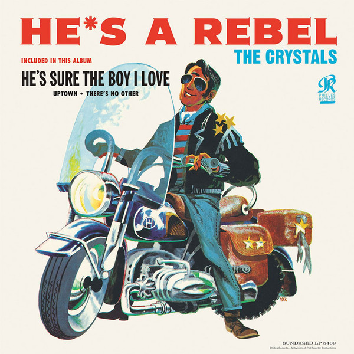

# He's A Rebel

By The Crystals

## Album Data

[Discogs URL](https://www.discogs.com/release/4107795-The-Crystals-Hes-A-Rebel)

- Label: Sundazed Music
- Formats: Vinyl, LP, Album, Reissue
- Genres: Pop
- Rating: 4.35
- Released: 2012-07-00
- Year: 1963
- Release ID: 4107795
- Media condition: 
- Sleeve condition: 
- Speed: 
- Weight: 
- Notes: 

## Album Tracks

| **Position** | **Title** | **Duration** |
|--------------|-----------|--------------|
| A1 | **He's A Rebel** | 2:25 |
| A2 | **Uptown** | 2:18 |
| A3 | **Another Country - Another World** | 3:00 |
| A4 | **Frankenstein Twist** | 2:47 |
| A5 | **Oh Yeah, Maybe Baby** | 2:23 |
| B6 | **He's Sure The Boy I Love** | 2:29 |
| B1 | **There's No Other (Like My Baby)** | 2:28 |
| B2 | **On Broadway** | 2:27 |
| B3 | **What A Nice Way To Turn Seventeen** | 2:40 |
| B4 | **No One Ever Tells You** | 2:16 |
| B5 | **He Hit Me (And It Felt Like A Kiss)** | 2:28 |
| B6 | **I Love You Eddie** | 2:55 |

## Artist Roles

| **Name** | **Role** |
|----------|----------|
| **Arnold Goland** | Arranged By |
| **Jack Nitzsche** | Arranged By |
| **Hal Blaine** | Drums |
| **Bill McMeekin** | Engineer |
| **Larry Levine** | Engineer |
| **Mike Spencer** | Piano |
| **Phil Spector** | Producer |
| **Steve Douglas** | Saxophone |

