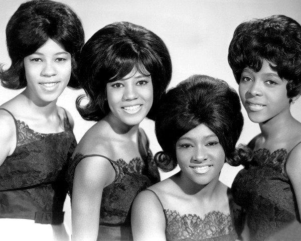

# The Crystals

## Artist Profile

Formed: 1961 in Philadelphia, United States 
Disbanded: 1967; re-united in 1971.
Current Members: 
Delores "Dee Dee" Kennibrew (1960 - 1967, 1971 - present)
Melissa "MelSoulTree" Grant aka Mel-Soul-Tree (2002 - present)
Patricia Pritchett-Lewis (2005 - present)

Former Members:
Barbara Alston (1961-1964) (1966-1973)
Mary Thomas (1961-1962) (1966-1973
Patricia "Pat" Wright (1961-1964)
Merna Girard (1961-1962)
Dolores "La La" Brooks (1962-1966)
Frances Collins (1964-1966) 
Peggi Blu (1974-1978)
Louise Bethune (1974-1978)
Jan Sonora (1978-1979)
Neenee Sonora (1978-1979)
Lisa Fischer (1980-1982)
Darlene Davis (1980-1988)
Gretchen Gale (1984-2001)
Marilyn Ali (1989-1994)
Marcella Matthews (1995-2001)

## Artist Links

- [http://www.thecrystals.net/](http://www.thecrystals.net/)

## See also

- [He's A Rebel](Hes_A_Rebel.md)
