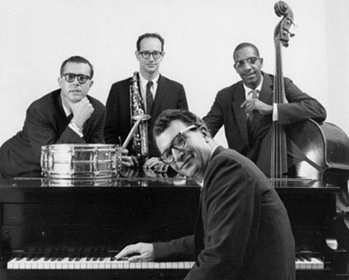

# The Dave Brubeck Quartet

## Artist Profile

The Dave Brubeck Quartet was a jazz quartet founded in 1951 by Dave Brubeck on piano together with Paul Desmond on saxophone. The Dave Brubeck Quartet disbanded in 1967, and only met again for its 25th anniversary in 1976. The band name would later be used by the pianist for other groups that he led.

## Artist Links

- [https://en.wikipedia.org/wiki/Dave_Brubeck#Dave_Brubeck_Quartet](https://en.wikipedia.org/wiki/Dave_Brubeck#Dave_Brubeck_Quartet)

## See also

- [Time Out](Time_Out.md)
