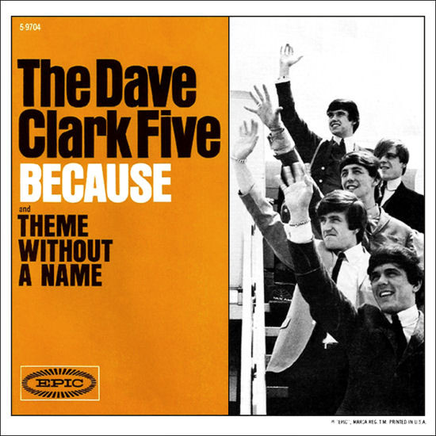

# Because / Theme Without A Name

By The Dave Clark Five

## Album Data

[Discogs URL](https://www.discogs.com/release/3068311-The-Dave-Clark-Five-Because-Theme-Without-A-Name)

- Label: Epic
- Formats: Vinyl, 7", 45 RPM, Single, Styrene
- Genres: Rock, Pop Rock
- Rating: 4.55
- Released: 1964
- Year: 1964
- Release ID: 3068311
- Media condition: 
- Sleeve condition: 
- Speed: 
- Weight: 
- Notes: 

## Album Tracks

| **Position** | **Title** | **Duration** |
|--------------|-----------|--------------|
| A | **Because** | 2:23 |
| B | **Theme Without A Name** | 2:03 |

## Artist Roles

| **Name** | **Role** |
|----------|----------|
| **Dave Clark** | Written-By |
| **Lenny Davidson** | Written-By |

