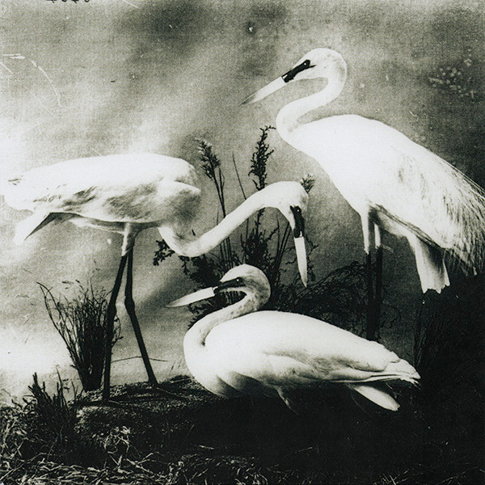

# Buzzkill(er) / It's Just Too Bad

By The Dead Weather

## Album Data

[Discogs URL](https://www.discogs.com/release/6150995-The-D%C3%A6d-W%C3%A6ther-Buzzkiller-Its-Just-Too-Bad)

- Label: Third Man Records
- Formats: Vinyl, 7", 45 RPM, Single, Limited Edition
- Genres: Rock, Hard Rock
- Rating: 4.11
- Released: 2014-10-00
- Year: 2014
- Release ID: 6150995
- Media condition: 
- Sleeve condition: 
- Speed: 
- Weight: 
- Notes: 

## Album Tracks

| **Position** | **Title** | **Duration** |
|--------------|-----------|--------------|
| A | **Buzzkill(er)** | 3:03 |
| B | **It's Just Too Bad** | 3:40 |

## Artist Roles

| **Name** | **Role** |
|----------|----------|
| **Trent Thibodeaux** | Artwork |
| **Wes Garland** | Lacquer Cut By |
| **Vance Powell** | Mixed By |
| **Mindy Watts** | Mixed By [Assisted By] |
| **Joshua V. Smith** | Recorded By |
| **Mindy Watts** | Recorded By [Assisted By] |

